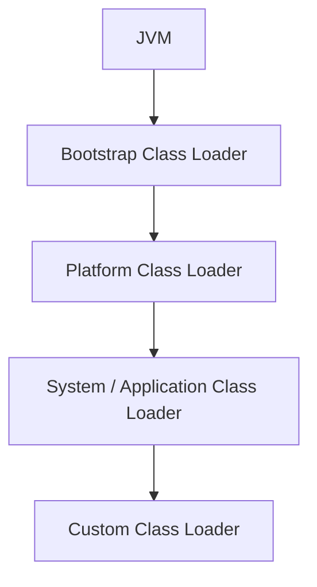
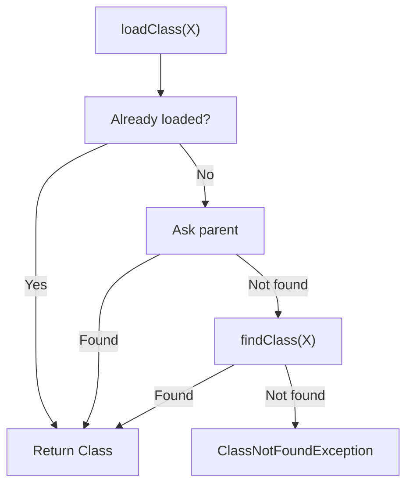
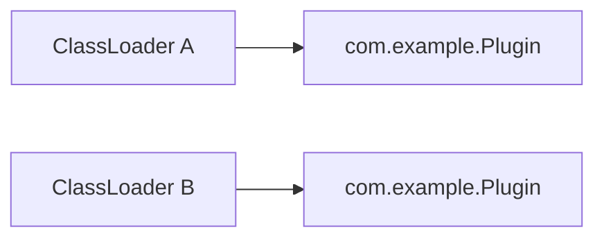
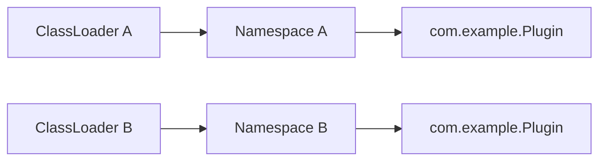
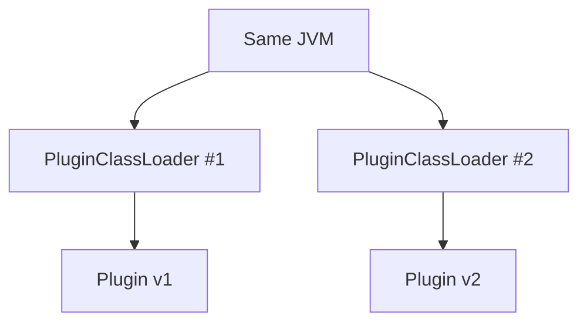
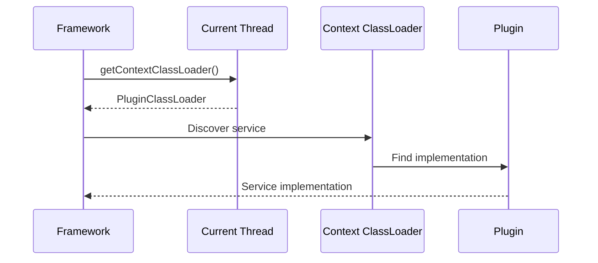
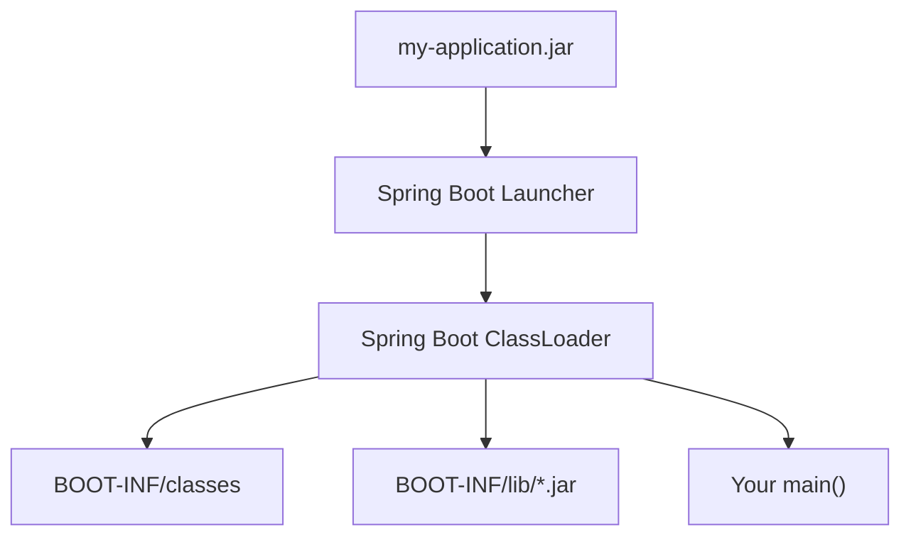
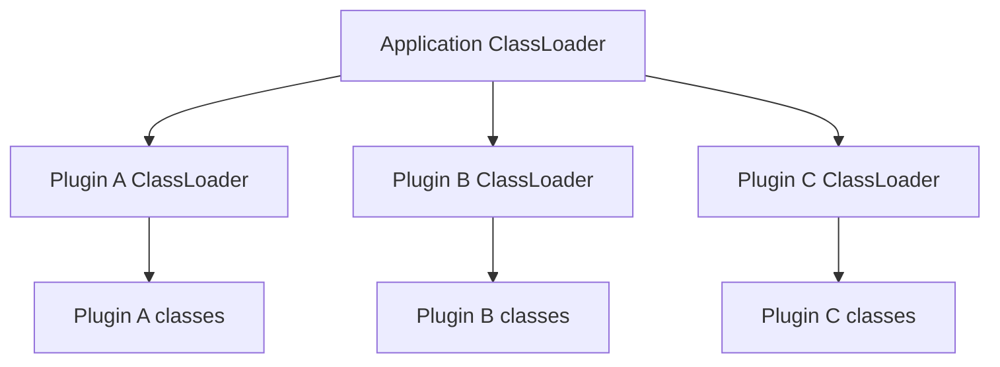
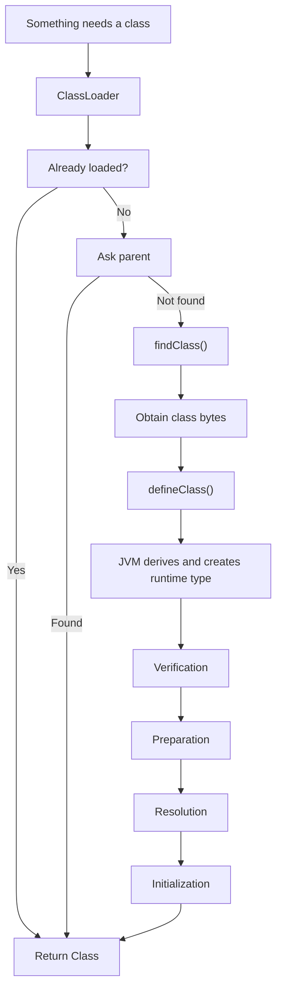

Hello reader, good day.

As my curiosity takes the best of me, I wanted to understand how one would write a plugin system in Java.

And, as usual, I made the mistake of asking **one innocent question about Java**.

That question led me straight into the JVM's basement.

The answer was:

**ClassLoaders.**

I initially thought this was going to be one of those topics where you read two blog posts, implement `loadClass()`, nod your head and move on with your life.

It wasn't.

Instead, I found out that ClassLoaders are involved in dynamic loading, namespaces, dependency isolation, plugin systems, framework internals, hot reloading, Spring Boot, and some of the most beautifully confusing exceptions Java can throw.

So this is me trying to put together what I learnt.

Hopefully by the end, we will both understand ClassLoaders.

If not, at least we will know who to blame (Hey, I'm not going to take the blame ! How dare you ?).

---

# 1. Why does a ClassLoader exist?

Let's start with the obvious question.

**Why can't the JVM just load every `.class` file when the application starts like a normal human being?**

Well firstly, because it's not human, it can't do stuff humans can do (stupid stuff basically)
secondly, it'd be such a TERRIBLE idea, imagine an application with hundreds of dependencies and thousands of classes.

My application might only need ***AbstractPokemonCodexPokemonFactory*** only once because I want to create just one pokemon (Charizard is my fav incase you're wondering)

I don't want the JVM to have that class for the entire damn time, who am I ? a lead in a romance novel who remembers all of his childhood girlfriends?, no. 
Your application might only need a tiny fraction of them for the code path it is actually executing.

Loading everything up front would mean spending startup time and memory on classes that may never be used.

So Java supports **dynamic class loading**.

The JVM can load classes as they become necessary, and a class loader can obtain class definitions from a source chosen by the loader.

That source does not have to be:

```text
somewhere on the classpath
```

It can be a directory, JAR, generated bytecode, or some completely custom source.

The [JVM Specification](https://docs.oracle.com/javase/specs/jvms/se25/html/jvms-5.html) describes loading as the process of finding the binary representation of a class and creating the runtime class from it.

This gives us some very useful properties:

- **Lazy loading** — don't load what you don't need.
- **Dynamic loading** — classes can come from places other than the normal classpath.
- **Isolation** — different class loaders can maintain different class namespaces.

And that last one is where things stop being boring.

---

# 2. What is a ClassLoader?

The official definition is almost suspiciously simple:

> A class loader is an object responsible for loading classes.

like seriously ? that's all i'm getting ? come on JDK people, not fair.

`ClassLoader` is an abstract Java class. We can create subclasses when we want to change how classes are found.

For example:

```java
ClassLoader loader = ...;

Class<?> clazz =
        loader.loadClass("com.example.Plugin");
```

Notice that we got:

```java
Class<?>
```

not:

```java
Plugin
```

This is important.

The ClassLoader is concerned with getting the **type** into the JVM.

Creating an object of that type is a separate operation:

```java
Object plugin =
        clazz.getDeclaredConstructor()
             .newInstance();
```

So, very roughly:


The [Java `ClassLoader` documentation](https://docs.oracle.com/en/java/javase/25/docs/api/java.base/java/lang/ClassLoader.html) is worth keeping open while reading this article. We are going to be coming back to it quite a bit.

Because apparently Java decided one `Class` object wasn't enough confusion.

---

# 3. The built-in ClassLoaders

Before we start writing our own ClassLoader like we know what we're doing, let's look at the ones Java already gives us, u know, follow the master until u master, something... something...

Modern Java has three important built-in class loaders:

1. Bootstrap Class Loader
2. Platform Class Loader
3. System/Application Class Loader

If you remember an **Extension ClassLoader**, that is old terminology from before the age of humanity (Java 9).

The current hierarchy is documented in the [Java SE `ClassLoader` API](https://docs.oracle.com/en/java/javase/25/docs/api/java.base/java/lang/ClassLoader.html).

## 3.1 Bootstrap Class Loader

At the top is the **Bootstrap Class Loader**.

This is responsible for loading core runtime classes.

Think:

```text
java.lang.Object
java.lang.String
java.lang.Class
...
```

Now try this:

```java
System.out.println(
    String.class.getClassLoader()
);
```

You will normally get:

```text
null
```

And this is where people say:

> "String doesn't have a ClassLoader."

No.

Please don't do that.

`String` was loaded by the bootstrap loader. The bootstrap loader is implemented by the JVM (native code so written in c++) rather than being an ordinary Java `ClassLoader` object, so it is represented by `null`.

So yes, `String` has a loader.

You just don't get to talk to him, because he's apparently he's too cool and metal, get it? :-) (I know I hate myself too).

---

## 3.2 Platform Class Loader

Below the bootstrap loader is the **Platform Class Loader**.

It loads platform classes that aren't loaded by the bootstrap loader.

You can get it with:

```java
ClassLoader platform =
    ClassLoader.getPlatformClassLoader();
```

This is the modern Java 9+ world.

The old Extension ClassLoader has left the building.

---

## 3.3 System/Application Class Loader

Then we have the **System Class Loader**, also commonly called the **Application Class Loader**.

You can obtain it using:

```java
ClassLoader app =
    ClassLoader.getSystemClassLoader();
```

For a normal application, this is the loader responsible for application classes available through the application class path or module path.

So, as a simplified mental model:



This isn't a law of physics and the JVM people aren't no newton or einstein.

You can create many user-defined class loaders and their relationships can get considerably more interesting.

But this is a good place to start.

---

# 4. Loading, Linking and Initialization

This is where my original mental model started falling apart.

I thought:

> "The JVM finds the `.class` file, reads it and Bob's your uncle."

The JVM said, suck it looser.

A class must go through a very painful selection process just like every other JEE student, I'm kidding, no it doesn't have the heart to do that, however it must go through these.

1. **Loading**
2. **Linking**
3. **Initialization**

And linking itself includes (nested steps, why ? cause screw you, that's why):
- Verification
- Preparation
- Resolution

The [JVM Specification, Chapter 5](https://docs.oracle.com/javase/specs/jvms/se25/html/jvms-5.html) goes into all of this in considerably more detail.


Let's actually understand what those words mean.

## 4.1 Loading

Loading is the process of finding the binary representation of a class and deriving a runtime class from it.

Usually that representation is a `.class` file.

But it doesn't have to be sitting on disk waiting for us, it can be sent to us in our dreams by an angel.

A custom loader could obtain bytes from:

- a JAR
- a database
- a network source
- generated bytecode
- an encrypted archive
- whatever other questionable place you decide is a good place to keep Java classes

The important bit is that the JVM eventually gets a binary representation from which it can create the class.

And this is the part that makes plugin systems possible.

---

## 4.2 Verification

The JVM checks whether the class-file representation satisfies the required structural and type-safety constraints.

Basically:

> "Are these actually class bytes, or did somebody feed me garbage?"

A reasonable question.

---

## 4.3 Preparation

Preparation creates the storage for static fields and gives them their default values.

This is easy to confuse with initialization.

Given:

```java
class Example {
    static int x = 42;
}
```

during preparation, `x` is not magically `42`.

It starts with its default value:

```text
x = 0
```

The explicit initializer runs later.

This distinction matters because the JVM has separate phases for preparing a class and actually executing its static initialization.

---

## 4.4 Resolution

Class files contain symbolic references.

For example, our class might refer to:

```text
java.lang.String
com.example.User
com.example.Database
```

The JVM can resolve those symbolic references to actual runtime entities.

And, because apparently doing everything immediately would have been too straightforward, resolution does **not** necessarily happen all at once, takes time (patience... patience is the key my friend, we'll it's more necessity but u know i'm being creative here right ?).

The JVM specification allows implementations flexibility about when linking activities happen.

So the JVM can effectively say:

> "I'll figure out what that thing means when you actually need it."

Fair enough.

---

## 4.5 Initialization

Finally, initialization.

This is where the class's static initialization actually happens.

For:

```java
class Example {

    static int x = 42;

    static {
        System.out.println("Hello");
    }
}
```

the compiler generates class-initialization code represented by `<clinit>`.

The JVM runs that initialization when the class needs to be initialized.

So the useful mental model is:

```text
Loading
    ↓
Verification
    ↓
Preparation
    ↓
Resolution
    ↓
Initialization
```

Just remember that resolution has some timing flexibility.

The JVM specification is the source of truth here, not the little diagram I drew five minutes ago.

---

# 5. Parent Delegation

Now we get to the part that makes ClassLoaders more interesting.

Suppose we have:

```text
Application ClassLoader
        ↓
Plugin ClassLoader
```

and the plugin asks:

```java
loadClass("java.lang.String");
```

Should the plugin loader load its own `String`?

**No.**

Absolutely not.

Imagine every plugin bringing its own:

```text
java.lang.String
java.lang.Object
java.util.List
```

We would have successfully transformed a plugin architecture into a distributed mental diarrhea (starts shitting in multiple places via multiple loaders).

The normal `ClassLoader` implementation uses a **parent delegation model**.

Roughly:



The [ClassLoader API documentation](https://docs.oracle.com/en/java/javase/25/docs/api/java.base/java/lang/ClassLoader.html) describes this delegation behaviour.

And this leads to a very useful rule when writing custom loaders:

> **Usually override `findClass()`, not `loadClass()`.**

Why?

Because the normal `loadClass()` implementation already handles the delegation logic.

Our job is simply:

> "Fine. The parent doesn't have it. Let me see if I can find it."

---

# 6. Class Identity

This is probably the most important part of the entire article.

We normally think:

```text
Class identity = class name
```

So:

```text
com.example.Plugin
```

is just:

```text
com.example.Plugin
```

Right?

**No.**

This is where Java gets interesting.

The JVM's notion of class identity takes the **binary name and the defining class loader** into account.

The [JVM Specification](https://docs.oracle.com/javase/specs/jvms/se25/html/jvms-5.html) explicitly discusses this in its class-loading rules.

Imagine:



Both loaders load:

```text
com.example.Plugin
```

But those can be two different runtime types.

So:

```java
Class<?> a =
    loaderA.loadClass("com.example.Plugin");

Class<?> b =
    loaderB.loadClass("com.example.Plugin");
```

can give us:

```java
a == b
```

as:

```text
false
```

while:

```java
a.getName().equals(b.getName())
```

is:

```text
true
```

Same name.

Different defining loader.

Different type.

This is the part where ClassLoaders stop being "something that finds `.class` files" and start becoming an actual **isolation mechanism**.

---

# 7. Class Loader Namespaces

Each class loader has a namespace containing the classes it defines.

So we can have:



Both namespaces contain:

```text
com.example.Plugin
```

and yet the JVM can treat them as different classes.

This is incredibly useful.

It means different parts of a JVM can potentially have different versions of a dependency without pretending they are the same type.

And that brings us to the most entertaining failure mode.

---

# 8. The "X cannot be cast to X" problem

Imagine we have:

```text
com.example.Plugin
```

loaded by ClassLoader A.

And another:

```text
com.example.Plugin
```

loaded by ClassLoader B.

Now some poor developer (me :-( ) does:

```java
Plugin plugin = (Plugin) object;
```

and Java throws:

```text
ClassCastException:
com.example.Plugin cannot be cast to com.example.Plugin
```

At this point, the natural response is:

> "Excuse me?"

The JVM isn't confused.

We are.

What it is actually saying is:

```text
com.example.Plugin
    loaded by Loader A

is not

com.example.Plugin
    loaded by Loader B
```

Same name.

Different runtime type.

If you ever see this sort of madness, check:

```java
object.getClass().getClassLoader();
```

and:

```java
Plugin.class.getClassLoader();
```

If those are different, you have a very strong suspect.

---

# 9. Writing Your Own ClassLoader

Okay.

Enough theory.

Let's actually write one.

Suppose our plugin classes live here:

```text
plugins/
    hello-plugin/
        com/example/HelloPlugin.class
```

A deliberately simplified ClassLoader might look like:

```java
public class PluginClassLoader extends ClassLoader {

    private final Path pluginDirectory;

    public PluginClassLoader(
            Path pluginDirectory,
            ClassLoader parent) {

        super(parent);
        this.pluginDirectory = pluginDirectory;
    }

    @Override
    protected Class<?> findClass(String name)
            throws ClassNotFoundException {

        Path path = pluginDirectory.resolve(
                name.replace('.', '/') + ".class"
        );

        try {
            byte[] bytes = Files.readAllBytes(path);

            return defineClass(
                    name,
                    bytes,
                    0,
                    bytes.length
            );

        } catch (IOException e) {
            throw new ClassNotFoundException(name, e);
        }
    }
}
```

There is one line here I care about more than the rest:

```java
findClass()
```

We didn't replace the whole loading mechanism.

We extended it.

The flow is still:

```text
loadClass()
    ↓
Already loaded?
    ↓ no
Ask parent
    ↓ not found
findClass()
    ↓
Get bytes
    ↓
defineClass()
```

That is the beauty of having an API designed around delegation.

We don't have to rebuild the entire JVM because we wanted to load one class from a different directory.

---

# 10. Hot Reloading

Now let's do something fun.

Suppose we have:

```text
Plugin v1
```

loaded by:

```text
PluginClassLoader #1
```

We modify the plugin.

We could restart the entire JVM.

Or, depending on the architecture, we can create:

```text
PluginClassLoader #2
```

and load the new version.



Because the defining loaders are different, the JVM can distinguish the two runtime types even if both have the same binary name.

This is one of the ideas behind hot-reload systems.

But now we have another problem.

If something is still holding onto the old loader through:

- a static field
- a cache
- a thread
- a Thread Context ClassLoader
- some framework object that apparently refuses to die

then the old classes may remain reachable too.

So hot reloading is not:

> "Create another ClassLoader."

It is:

> "Create another ClassLoader and then clean up the old one properly."

Otherwise you have successfully implemented **hot reloading with bonus memory leaks**.

---

# 11. Thread Context ClassLoader

Now we reach one of those lines that I used to see in framework code and just mentally classify as:

> "Framework people know what they're doing. Don't touch."

```java
Thread.currentThread()
      .getContextClassLoader();
```

Turns out there is a reason for it.

Sometimes the code performing the loading belongs to one ClassLoader, while the application classes it needs to discover belong to another.

The **Thread Context ClassLoader**, or TCCL, gives code a loader associated with the current execution context.

A very common example is `ServiceLoader`.

For:

```java
ServiceLoader.load(MyService.class);
```

the no-argument-loader form uses the current thread's context class loader.

See the [Java `ServiceLoader` documentation](https://docs.oracle.com/en/java/javase/25/docs/api/java.base/java/util/ServiceLoader.html).

Conceptually:



And suddenly that weird `getContextClassLoader()` call stops looking like framework black magic.

It is there because sometimes **the code doing the asking and the code being asked for live in different class-loader worlds**.

---

# 12. Spring Boot: the practical rabbit hole

Now let's connect all of this to something most Java developers have probably used.

You run:

```bash
java -jar my-application.jar
```

and Spring Boot gives you an executable JAR that roughly looks like:

```text
my-application.jar
│
├── META-INF/
│
├── org/springframework/boot/loader/
│
└── BOOT-INF/
    ├── classes/
    │   └── your application classes
    │
    └── lib/
        ├── spring-core.jar
        ├── jackson.jar
        └── ...
```

Now here's the problem.

Java does not have a standard mechanism for treating JARs nested inside another JAR as ordinary classpath entries.

Spring Boot therefore has its own executable-JAR loader infrastructure.

The [Spring Boot executable JAR documentation](https://docs.spring.io/spring-boot/specification/executable-jar/nested-jars.html) explains the nested-JAR layout and why the loader exists.

The launcher sets up an appropriate ClassLoader and eventually calls your application's `main()` method. This is documented in [Spring Boot's launching documentation](https://docs.spring.io/spring-boot/specification/executable-jar/launching.html).

Conceptually:



And Spring Boot's `NestedJarFile` machinery can locate entries inside nested JARs without simply unpacking the whole thing first.

[Spring Boot — NestedJarFile](https://docs.spring.io/spring-boot/specification/executable-jar/jarfile-class.html)

So:

```bash
java -jar app.jar
```

is not:

> "Java saw the JAR and figured it out."

There is actual machinery making those nested dependencies visible.

Which is exactly why understanding ClassLoaders is useful.

---

# 13. And this is where TCCL comes back

Spring Boot's executable-JAR documentation has an interesting restriction.

Launched applications should use:

```java
Thread.currentThread()
        .getContextClassLoader();
```

when loading classes.

Trying to load nested-JAR classes through the system ClassLoader can fail.

See:

[Spring Boot — Executable JAR Restrictions](https://docs.spring.io/spring-boot/specification/executable-jar/restrictions.html)

So we have now come full circle.

We started with:

```java
Thread.currentThread()
      .getContextClassLoader();
```

looking like one of those lines that frameworks put in code because apparently Java requires three lines of ritual before a class is allowed to exist.

Then we learned:

- class-loader hierarchies
- delegation
- namespaces
- custom loaders
- nested JARs

and suddenly the line makes sense.

This is probably my favourite part of learning JVM internals while looking to understand weird things.

You discover that the only weird thing all this time was you and your foolish brain who though you knew it all (too much self reflection ? no ?).

You just didn't know the machinery behind it.

---

# 14. ClassLoaders as an Isolation Mechanism

Suppose our application has:

```text
Application
├── Plugin A
├── Plugin B
└── Plugin C
```

We can give each plugin its own loader:



Now imagine:

```text
Plugin A
    Library X v1

Plugin B
    Library X v2
```

Separate class-loader namespaces can allow these different versions to coexist.

This is one of the reasons ClassLoaders have historically been useful for plugin systems, application servers and other modular Java environments.

But there is an important distinction:

**Class-loader isolation is not the same thing as security sandboxing.**

A separate ClassLoader does not magically make arbitrary hostile Java code safe.

So please don't build:

```text
UntrustedPlugin
    ↓
new ClassLoader()
    ↓
"security achieved"
```

and then go home early (ohh you're definitely going home early, after your ass is fired).

It is not.

---

# 15. Security

ClassLoaders have historically been part of Java's security architecture because they participate in controlling where classes come from and which namespaces they belong to.

But the old Java security model needs some context here.

The `SecurityManager` mechanism is deprecated for removal in modern Java, so we should not present ClassLoaders as a general-purpose sandbox for executing hostile code.

For modern systems, it is much safer to think of ClassLoaders primarily in terms of:

- dynamic loading
- namespace separation
- dependency isolation
- plugin architectures
- framework infrastructure

rather than:

> "Put suspicious code in another ClassLoader and it becomes harmless."

Hey, I'm no security expert but I know just because the cat closes its eyes while drinking milk doesn't mean I don't see it, my eyes are open baby.

---

# 16. When ClassLoaders go wrong

And now we reach the part where knowing all of this becomes genuinely useful.

## 16.1 `ClassNotFoundException`

Usually means the requested class could not be found by the relevant loading process.

In human terms:

> "I looked where I was supposed to look and it isn't there, MOM?!!!!!!"

---

## 16.2 `NoClassDefFoundError`

This is different.

It can occur when the JVM needs a class definition but cannot successfully obtain it during execution.

The JVM specification describes how failures during loading can surface as `NoClassDefFoundError`, including when the underlying cause is a `ClassNotFoundException`.

See [JVMS §5.3](https://docs.oracle.com/javase/specs/jvms/se25/html/jvms-5.html).

So please don't diagnose both errors as:

> "Classpath issue."

That diagnosis is technically possible.

It is also about as useful as telling a mechanic:

> "The car is making a sound."

---

## 16.3 Linkage errors

Then there are errors such as:

```text
NoSuchMethodError
NoSuchFieldError
IncompatibleClassChangeError
VerifyError
```

These often mean the runtime classes don't match what the code was compiled against or what the JVM expects during linkage.

If your application compiled perfectly and production immediately greeted you with:

```text
NoSuchMethodError
```

congratulations.

You've entered the basement.

---

## 16.4 `ClassCastException` involving the same class name

If you see:

```text
com.example.Plugin cannot be cast to com.example.Plugin
```

don't immediately assume Java has forgotten basic mathematics.

Check:

```java
object.getClass().getClassLoader();
```

and:

```java
Plugin.class.getClassLoader();
```

If the loaders differ, you may have found the problem.

---

# 17. The mental model I ended up with

If I had to compress the whole rabbit hole into one picture:



And underneath everything, keep this in your head:

```text
Runtime type identity
        =
Binary name
        +
Defining ClassLoader
```

That one idea explains an unreasonable amount of Java behaviour.

---

# 18. Why should I care?

If you're writing a normal CRUD application, you might never intentionally write:

```java
extends ClassLoader
```

( who ? me ? noo, I'd never write that, I'm kind of smart ok ?)
And that's perfectly fine.

You don't need to understand how the internal combustion engine works every time you drive to work, you just have to know how to handle Clutch, Gear, Throttle (Or whatever you automatic driving loosers need to use, drop that eyebrow I'm just making a joke).

But ClassLoaders become extremely relevant when you run into:

- plugin architectures
- application servers
- dependency isolation
- hot reloading
- framework internals
- Spring Boot executable JARs
- `ServiceLoader`
- generated bytecode
- multiple versions of the same dependency
- mysterious `ClassCastException`s
- mysterious `NoSuchMethodError`s

And this is why I found the topic interesting.

I started with:

> "How would I write a plugin system?"

and ended up learning:

> "Why can two classes with the exact same name be completely different types?"

This is generally how JVM rabbit holes work.

You open one door.

There are seventeen more doors behind it.

And someone at OpenJDK has apparently installed a staircase.

---

# 19. Final Thoughts

ClassLoaders are one of those pieces of Java that are almost completely invisible when everything is working.

You write:

```java
new ArrayList<>();
```

and don't care how `ArrayList` became a runtime type.

You write:

```java
ServiceLoader.load(...)
```

and don't think about how the implementation gets discovered.

You run:

```bash
java -jar application.jar
```

and don't question how classes inside nested dependency JARs become visible.

And that's exactly the point.

**ClassLoaders are infrastructure.**

They quietly sit underneath the application and make dynamic loading, namespaces, dependency isolation and extensibility possible.

Until something breaks.

Then suddenly you're staring at:

```text
com.foo.Bar cannot be cast to com.foo.Bar
```

at 3 AM.

And now you know why.

---

# Sources / Further Reading

- [Java Virtual Machine Specification — Chapter 5: Loading, Linking and Initializing](https://docs.oracle.com/javase/specs/jvms/se25/html/jvms-5.html)
- [Java SE 25 — `ClassLoader` API](https://docs.oracle.com/en/java/javase/25/docs/api/java.base/java/lang/ClassLoader.html)
- [Java SE 25 — `ServiceLoader` API](https://docs.oracle.com/en/java/javase/25/docs/api/java.base/java/util/ServiceLoader.html)
- [Java Language Specification — Loading of Classes and Interfaces](https://docs.oracle.com/javase/specs/jls/se25/html/jls-12.html)
- [Spring Boot — Executable JAR Format](https://docs.spring.io/spring-boot/specification/executable-jar/)
- [Spring Boot — Nested JARs](https://docs.spring.io/spring-boot/specification/executable-jar/nested-jars.html)
- [Spring Boot — Launching Executable JARs](https://docs.spring.io/spring-boot/specification/executable-jar/launching.html)
- [Spring Boot — NestedJarFile](https://docs.spring.io/spring-boot/specification/executable-jar/jarfile-class.html)
- [Spring Boot — Executable JAR Restrictions](https://docs.spring.io/spring-boot/specification/executable-jar/restrictions.html)

